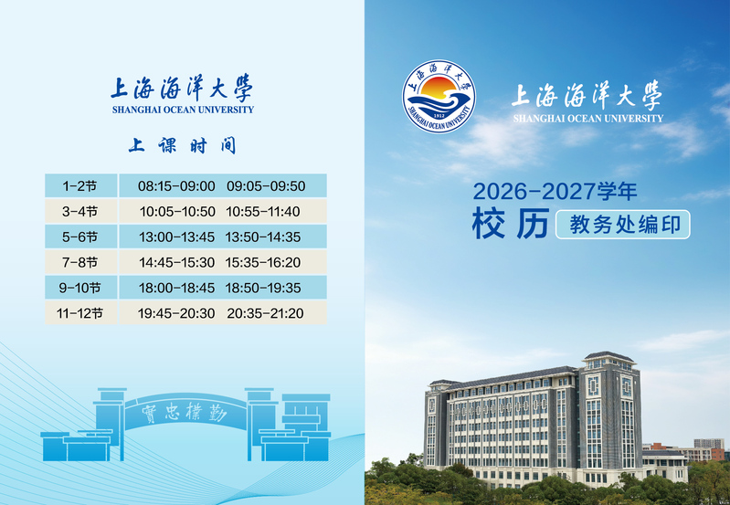
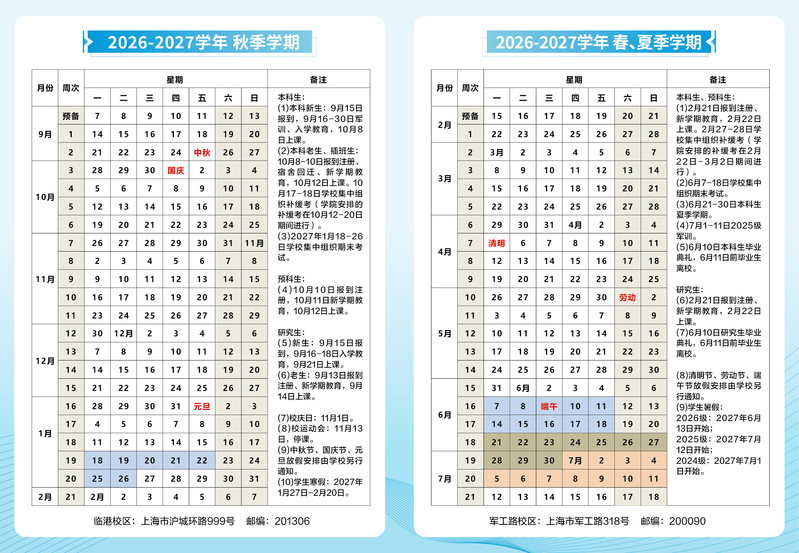

# 校历

## 2026—2027 学年

校历来自上海海洋大学教务处，包含上课时间和 2026—2027 学年秋季、春夏学期的校历安排。

图片来源：[教务处校历页面](https://jwc.shou.edu.cn/xl/list.htm)。

**来源入口核验：2026-09-14**。教务处当前校历栏目为“2026-2027学年”；查往年安排时，使用该页面按学年列出的历史栏目，不要把旧图上的日期套用到本学年。本次确认了官方栏目与学年，未重新逐格校对本地图片。

## 按校历安排行程

1. 先核对学年及秋季、春夏学期，再查所在周和星期。
2. 选课、补退选、考试和新生报到的具体截止时间，继续查看教务处、学院及相应通知；校历不能替代个人课表和考场安排。
3. 调休、临时停课或活动变化，按最新正式通知调整；有冲突时向学院教务确认后再安排行程。

:::warning[信息时效]
校历会按学年更新，具体安排以学校教务处最新发布的校历为准。
此外，遇到特殊变动时（如装修），旧校历也可能失去适用性。
:::
