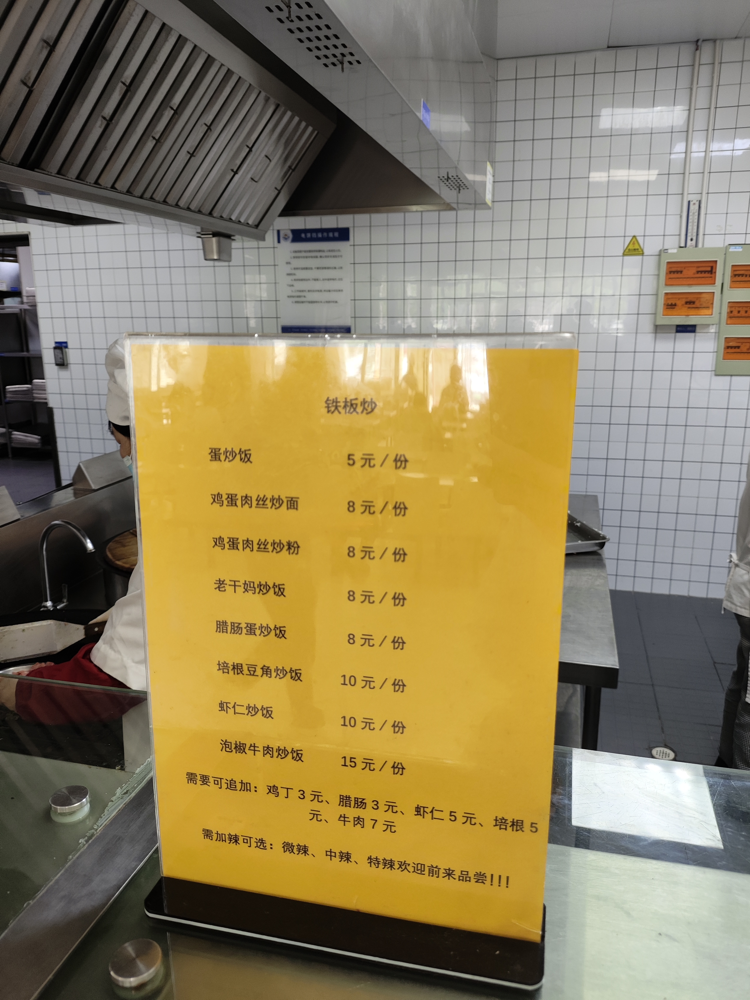

# 饮食

关于校外饮食及同学餐饮体验，可以参见[今日海大吃什么](https://github.com/Conduit-Club/what-to-eat-in-shou-today-done-right)。

## 供餐时间与就餐准备

- **营业时间**：各楼层和窗口有所不同，以现场公示为准；假期安排见[后勤通知公告](https://hqc.shou.edu.cn/9783/list.htm)。
- **支付**：按窗口支持的方式付款，充值等业务见[校园卡](/service/campus-card/)。
- **价格**：各窗口差别比较大。下面出现的金额都是同学分享的实付价，或者凭印象记的，我们也没有逐条核对过现场价目表，只能作为大致参考。
- **问题反馈**：保存窗口、消费时间与订单信息，向现场负责人反映。

## 入驻业务

店铺点位沿用同学提供的信息。欢迎按店补充商品、推荐、实付价格和到店日期。

### 校内便利店与饮品

#### A 区 7-11 便利店

- **位置**：A 区，具体楼栋待补充。
- **有什么**：便利店，具体商品和熟食待补充。
- **消费范围**：待补充实付价格。

#### B 区 7-11 便利店

- **位置**：研究生区，与第三食堂同楼。
- **有什么**：便利店，具体商品和熟食待补充。
- **消费范围**：待补充实付价格。

#### 二餐一楼 蜜雪冰城区

- **位置**：第二食堂一楼。
- **有什么**：蜜雪冰城饮品店，当前菜单待补充。
- **消费范围**：待补充本店实付价格。

## 校内餐厅

学校设有一食堂、二食堂和三食堂：**一、二食堂靠近本科生宿舍区，三食堂靠近研究生区**。2026 级新生可在报到当天与家长前往就餐，具体开放窗口和供餐时间以现场公告为准。

另有面向少数民族师生的风味餐厅，在第二食堂二楼靠外侧，详见下文的风味餐厅部分。来源：后勤[餐饮保障](https://hqc.shou.edu.cn/cybz/list.htm)、[2026 级新生报到指南](https://mp.weixin.qq.com/s/Ij-n7Y8YEUuHfKWTxkcUuA)。

### 一食堂

后勤介绍中列有芝士焗饭、砂锅煲、麻辣烫等品类，具体楼层和窗口待补充。

#### 一楼

有早餐、「大伙」打菜、面食、馄饨、酱香饼和铁板窗口。后续可在[一食堂条目](https://github.com/Conduit-Club/what-to-eat-in-shou-today-done-right/blob/main/src/content/restaurants/first-canteen.json)查看同学餐品与体验。窗口及价格以现场为准。

#### 二楼

有现煮酸菜鱼窗口和滑蛋饭，窗口及现价可能变化。详见[一食堂条目](https://github.com/Conduit-Club/what-to-eat-in-shou-today-done-right/blob/main/src/content/restaurants/first-canteen.json)。

### 二食堂

二餐改造为智慧餐厅，后勤介绍中列有水饺、螺蛳粉、肠粉等品类，具体档口及楼层待补充。

#### 一楼

有打菜窗口、砂锅窗口和蜜雪冰城。档口、配菜与菜单可能变化，以现场为准；餐品体验见[二食堂条目](https://github.com/Conduit-Club/what-to-eat-in-shou-today-done-right/blob/main/src/content/restaurants/second-canteen.json)。

#### 二楼

同学提到炸鸡、酸辣粉、凉皮、葱油拌面、烧腊、河南烩面、炒刀削、咖喱饭和盖浇饭等品类。具体窗口、开设时间和评价见[二食堂条目](https://github.com/Conduit-Club/what-to-eat-in-shou-today-done-right/blob/main/src/content/restaurants/second-canteen.json)。

#### 风味餐厅

风味餐厅面向少数民族师生，有特殊饮食需求可以直接问工作人员。餐厅在第二食堂二楼靠外侧，位置可以在[校园地图](/facilities/campus-map.html)上找到。菜单、价格及同学体验见[风味餐厅条目](https://github.com/Conduit-Club/what-to-eat-in-shou-today-done-right/blob/main/src/content/restaurants/flavor-restaurant.json)。

### 第三食堂

以下是我们整理的用餐体验，窗口可能调整。第三食堂所在楼宇坐落于研究生区，与 B 区的 7-11 便利店共处一座楼宇。食堂一共两层，一楼偏向常规的早餐和打菜，二楼的窗口更多一些，吃饭的选择也相对丰富。

#### 一楼

一楼大致可以分为三个区域。早餐期间，一般只有面食区域和靠近糕点房的窗口开放。这里有豆浆、白粥、油条、豆花、肉包等常见的早餐，整体上属于比较常规的食堂早餐。

面食区域主要卖面条，可以添加雪菜、素鸡等配菜。糕点房供应常见糕点，想买早餐或打包带走，可以到这里看看。

早餐时段以外，一楼通常可以打菜，就是常规的大学食堂打菜，菜品种类不算丰富，选择也没有特别多。单纯想吃打菜的话，不如去二餐一楼。

- **吃饱首选**：铁板炒（新出现的窗口，不以口感和充分营养为优先，单纯想吃饱的选择）。

#### 二楼

二楼的窗口相对丰富一些。除了种类更多的面食窗口外，目前还有麻辣烫窗口、牛肉牛杂粉丝汤与凉皮窗口、「川香小炒」炒菜窗口、韩式料理窗口，以及类似二餐一楼的小碟菜窗口。

选择多了，价格自然也比一楼高一些。不过二楼整体上似乎更受欢迎，不少海大教师也会在三食堂二楼就餐。想换点口味，或者不想吃一楼的常规打菜，可以直接上二楼看看。

三餐各窗口的具体价格待补充。记录时可注明「窗口名、点了什么、花了多少、哪天吃的」，方便比较。

## 本页信息的来源

- **官方来源**：食堂范围、窗口品类和假期安排以后勤[餐饮保障](https://hqc.shou.edu.cn/cybz/list.htm)和[通知公告](https://hqc.shou.edu.cn/9783/list.htm)为准。
- **同学经验**：一餐、二餐的窗口、推荐餐品和价格来自同学在小红书公开帖子和评论里的分享，2026-09-19 整理。为避免公开个人账号，这里不附原帖链接；发言的人身份没有核实，价格也没有核对过现场价目表。
- **使用边界**：档口和价格每学期都可能调整，以现场窗口和价目表为准。如果发现和现场不一致，可以按[贡献模板与示例](/site-help/contribution-template.html)写清窗口名、点了什么、花了多少和用餐日期。

## 更多餐饮体验

[今日海大吃什么](https://github.com/Conduit-Club/what-to-eat-in-shou-today-done-right)按店铺整理校内及学校周边的餐品、位置、价格来源和同学体验。校内窗口与价格会变化，具体以现场和当前记录为准。
