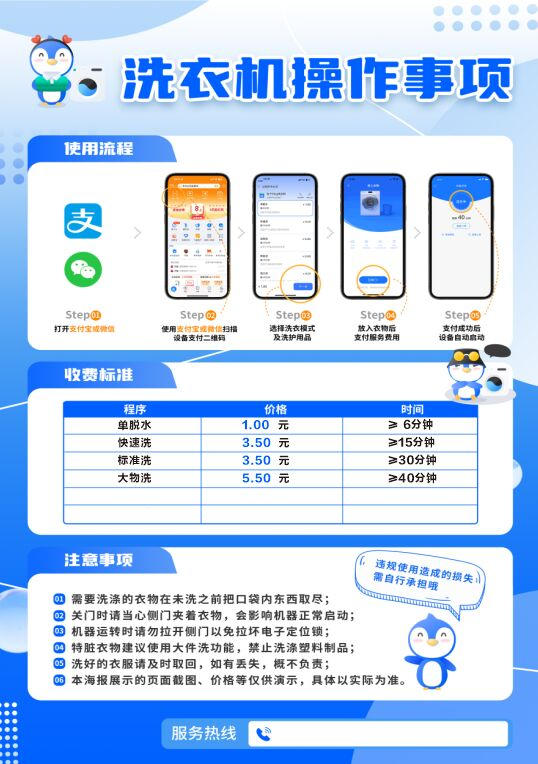
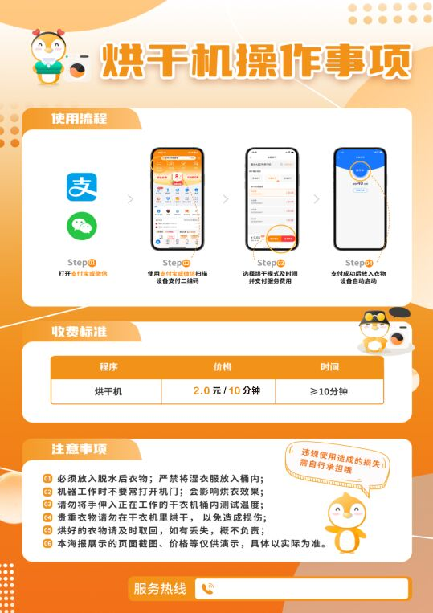
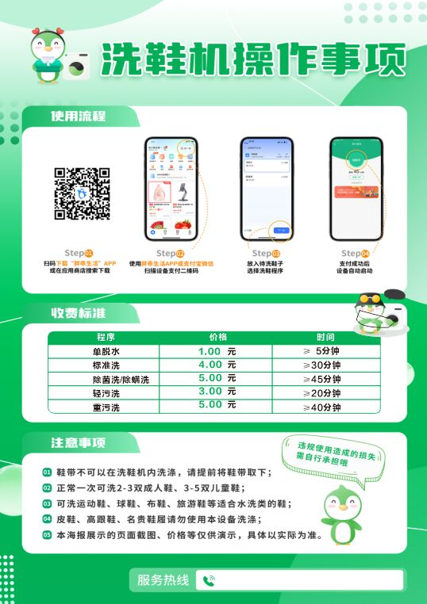
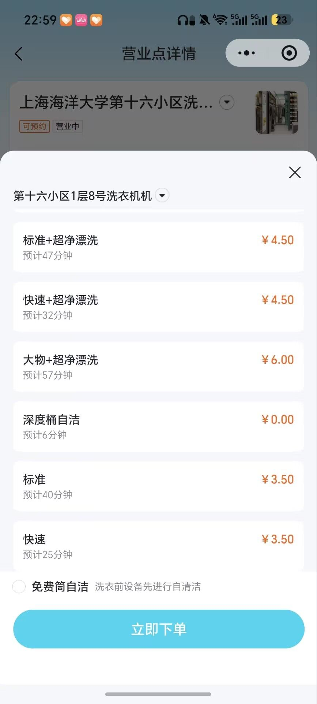
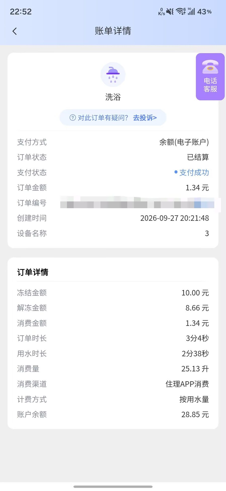

# 校园设施

## 常用设施怎么找

| 需要做什么                   | 入口或位置                                                                    |
| ---------------------------- | ----------------------------------------------------------------------------- |
| 找教学楼、学院楼、食堂、宿舍 | [校园地图](/facilities/campus-map.html)                                       |
| 借书、阅读、自习             | [图书馆服务](/service/library/)                                               |
| 打印、复印                   | [自助打印机位置与使用说明](/service/teaching/printer.html)                    |
| 吃饭                         | [饮食](/canteen/)                                                             |
| 补校园卡                     | 图文信息中心一楼南门、第一食堂一楼西门的自助补卡机；故障咨询 **021-61900222** |
| 取寄包裹                     | [快递与邮件收发](/service/packages/)                                          |
| 使用实验室                   | 向所属学院或课程负责老师了解培训、预约及准入要求                              |

补卡机位置来源：[2025-06-03 启用通知](https://hqc.shou.edu.cn/2025/0603/c9783a341260/page.htm)。操作说明见[校园卡](/service/campus-card/)。

## 学生公寓与生活设施

房型及公共设备可看后勤[学生公寓介绍](https://hqc.shou.edu.cn/9796/list.htm)。宿舍分批维修后可能有所变化，具体以分配到的房间为准。

### 住宿体验

[大学生活质量指北](https://colleges.chat/universities/shang-hai-hai-yang-da-xue/#q)的回答者 A31656（2025-07）觉得上下铺房间空间较大，但个人隐私较弱。这是 2026 年宿舍维修前的外部个人体验；更多评价见[校外评价与就读体验](/media/#校外评价与就读体验)。

### 洗衣、饮水与公共用品

- **洗衣**：学生公寓小区一楼（门房附近）设自助洗衣房。现场操作说明显示，可用支付宝或微信扫描设备二维码，按页面选择洗衣模式；图示价格为单脱水 **1 元（至少 6 分钟）**、快洗 **3.50 元（至少 15 分钟）**、标准洗 **3.50 元（至少 30 分钟）**、大物洗 **5.50 元（至少 40 分钟）**。学校后勤公开页面确认公寓区配有洗衣机、烘干机，但没有确认统一的洗衣 App；以机器屏幕或现场二维码显示的支付方式、机型和价格为准。使用前确认机器编号和模式，结束后取走衣物；故障时保留机器编号、订单和扣款截图，联系机器上的客服或物业。
- **装修后新宿舍不必强制安装「胖乖生活」**：有同学反馈，装修后新宿舍的洗衣机**并不是必须使用「胖乖生活」App**，扫码页面中的引导安装并非唯一支付途径。该同学同时反映，此 App 存在逾越合理权限的情况，包括通过加速度传感器检测并触发跳转、过度采集与存储信息、索取定位权限、诱导绑定多个平台的支付，以及申请与洗衣无关的手机相册权限；因此建议直接使用支付宝扫码下单，避免被诱导消费或过度授权。以上为同学一手提醒，不是学校官方结论；是否必须安装某个 App、以现场扫码页和设备屏幕提示为准。若扫码页反复要求安装、开通多平台支付或索取无关权限，可以换用支付宝等直接下单方式，并保留订单和扣款截图。
- **未涉及装修的小区（老小区）**：洗衣机服务仍由「海乐生活」提供。第十六小区一层 8 号洗衣机的价格表显示：标准＋超净漂洗 **4.50 元**（预计 47 分钟）、快速＋超净漂洗 **4.50 元**（预计 32 分钟）、大物＋超净漂洗 **6 元**（预计 57 分钟）、标准 **3.50 元**（预计 40 分钟）、快速 **3.50 元**（预计 25 分钟）；深度桶自洁 **0 元**（预计 6 分钟），洗衣前的免费简自洁也会在页面显示。不同小区和设备可能有差异，扫码下单页为准。
- **烘干与洗鞋**：现场说明显示烘干机 **2 元/10 分钟**（至少 10 分钟）；洗鞋机支持单脱水 1 元、标准洗 4 元、除菌洗/除螨洗 5 元、轻污洗 3 元、重污洗 5 元，具体时长以设备页面为准。操作图和价格仅作现场服务说明，设备更换后以机器页面为准。
- **桶自洁**：社团群与 QQ 频道中已有超过 3 名同学独立提及，扫码使用洗衣机的「桶自洁」功能收费 **1 元**；多人验证了这一价格。现场设备更换或价格调整时，以扫码页面为准。
- **淋浴热水**：2026 学年热水服务商与 2025 学年相同，按用水量计费，价格为 **53 元/吨**（0.053 元/升）。住理 App 账单示例显示，25.13 升用水消费 1.34 元，支付渠道为「住理 APP 消费」；该截图是个人账单凭证，实际余额、冻结金额和结算规则以 App 订单为准。若机器所在淋浴间网络不稳定，社团群同学反馈可能需要用能正常上网的手机通过蓝牙配对后扫码付款；这类特殊情况下的具体操作流程尚未取得可靠说明，不要反复扣款，先联系设备客服或宿舍值班室。

- **饮水**： 有一楼开水间及桶装水服务，取水、配送和押金可问本小区值班室。
- **公共用品**： 公共区域配有微波炉、吹风机等，先看看已有设备再采购；见[什么值得买](/service/what-to-buy/)。
- **淋浴与电费**： 热水故障可按下方流程报修；电费充值和计费问题可问本小区值班室。

### 入住检查与报修

建议入住当天和室友检查门锁、床架、照明、插座及漏水情况，拍照记录已有损坏并告知值班室。物业设施报修流程：

1. 扫描**公寓或教学楼公告栏**上的「后勤帮」二维码。
2. 填写具体地址、姓名、联系电话，补充故障文字及图片后提交。
3. 在小程序中跟踪工单，维修完成后检查结果并评价。

**24 小时物业报修：021-61900991**。来源：[「后勤帮」使用说明](https://hqc.shou.edu.cn/2024/0318/c9783a327438/page.htm)（2024-03-15）。洗衣设备的扣款、退款问题可联系机器上的客服。

## 体育场馆

场馆开放、预约及收费见[后勤通知公告](https://hqc.shou.edu.cn/9783/list.htm)或场馆现场公示。

**室外网球场施工提示**： [2026-06-20 通告](https://hqc.shou.edu.cn/2026/0621/c18828a353832/page.htm)因宿舍维修关闭室外网球场，恢复另行通知，求志路全路段禁停机动车及非机动车。恢复时间待确认。

## 无障碍与需要协助的情形

需要轮椅通行、搬运行李或其他协助时，可提前联系学院及楼宇管理人员，确认入口与陪同安排。各楼无障碍设施位置待补充。
