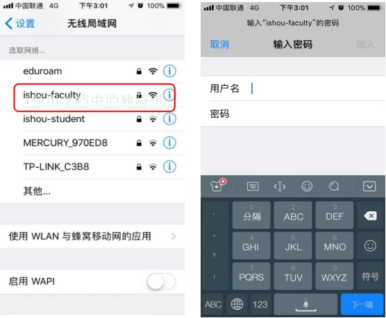
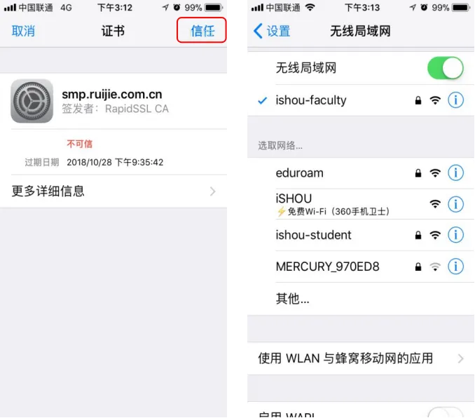
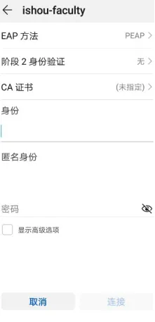
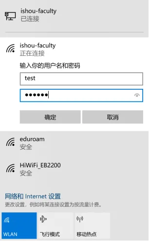
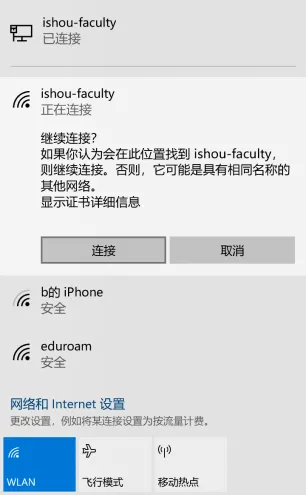

# 校园无线网络

上海海洋大学校园无线网络使用统一身份认证账号登录。适用对象：临港校区师生；最近公开说明核验：**2026-09-14**，未现场实测。

本文旨在帮助学生、教职工、访客和校外来宾连接校园无线网络。

## 先看较新的官方说明

现教中心[如何连接校园无线网络](https://xjzx.shou.edu.cn/2024/0226/c12937a326541/page.htm)发布于 **2024-02-26**：学生使用 **`ishou_student`**、教职工使用 **`ishou_faculty`**，并要求首次先用手机连接成功后再使用笔记本等设备。这里的网络名使用下划线，与下方 2020 年材料中的连字符不同。

该说明给出的 Android 设置为：EAP 方法 `PEAP`、阶段 2 身份验证 `GTC`、CA 证书「不验证」；如系统要求域名，填 `smp.ruijie.com.cn`。账号和密码使用学校统一身份认证信息。苹果手机按提示输入身份与密码。不同系统若不提供这些选项，应咨询 **021-61900238**，不要套用不匹配的截图。

:::warning[旧教程的适用范围]
下方步骤与截图来自 **2020-09-17** 的旧教程，仅供识别历史配置。其覆盖范围、最多 5 台设备、访客网络名及证书设置均未在 2026 年现场重新验证。学校返修后的网络请以最新通知和现教中心答复为准；访客与 eduroam 的较新官方说明见[校园网络总览](/service/network/)。
:::

## 2020 年连接教程（历史资料）

:::tip[原文地址]
[海大新一代无线校园网（WiFi6）开通啦！](https://mp.weixin.qq.com/s/dHvYIw9cop1QO6P4PL4Pzw)（发布于 2020-09-17）
:::

## 可用网络

- `ishou-faculty`：供教职员工使用。
- `ishou-student`：供学生使用。
- `ishou-guest`：供访客上网（调试阶段）。
- `ishou-meeting`：供校外参会人员使用（调试阶段）。
- `eduroam`：供全球教育无线网漫游联盟成员使用。

通常情况下，阅读本手册者只需使用前两者。

首次认证通过后，之后可无感知自动接入校园无线网，并支持 **最多 5 台设备** 同时在线。

## 连接方式

### iPhone / iPad（iOS）

1. 打开「设置」 → 「WLAN」，搜索到对应网络。
2. 在身份和密码中输入 **「统一身份认证账号和密码」** _（用户名为学号或工号，同网上办事大厅登录账号）_ 。
3. 弹出证书提示时，点击「信任」，即可连接。
   
   

### Android

1. 打开「设置」 → 「WLAN」，搜索到对应网络。
2. 在身份和密码中输入 **「统一身份认证账号和密码」** _（用户名为学号或工号，同网上办事大厅登录账号）_ 。
3. 若提示证书或身份验证，通常按默认值即可；若无法连接，可确认 **「身份验证」** 选择 **「无」** 、 **「CA 证书」** 选择 **「未指定」**。

:::warning[特别提醒]
不同 Android 系统所需设置不同，请格外注意身份验证和 CA 证书设置，通常为 _「无」_ 或 _「未指定」_。

如设置错误，可能出现连接成功但无法上网的情况，尝试重新连接并修改设置。
:::

### Windows

1. 点击右下角网络图标，搜索到对应网络。
2. 在身份和密码中输入 **「统一身份认证账号和密码」** _（用户名为学号或工号，同网上办事大厅登录账号）_ 。
3. 在弹出的「继续连接」确认页中点击「连接」。
   
   

## 常见问题

### 连接相关

- 连接无需先打开网页再登录，直接连接 Wi‑Fi，输入账号密码即可。
- 同一账号下 **最多支持 5 台设备** 同时在线。
- 如遇仅某台设备无法连接：
  1. 请先仔细阅读前文；
  2. 如仍无法连接，可尝试在该设备中「忘记」旧网络，再输入新账号密码重新连接；
  3. 如仍无法连接，尝试修改密码后重复以上步骤。

### 密码相关

- 密码同统一身份认证密码，可登录网上办事大厅，在「个人中心」 → 「账户安全」中修改密码。
- 修改统一身份认证密码后需重新连接；设备可能需要「忘记旧网络」。
- 忘记密码请拨打电话 _61900238_ 重置。

## 相关入口

- [网上办事大厅](https://portal.shou.edu.cn/)
- [现代信息与教育技术中心](https://xjzx.shou.edu.cn/)
