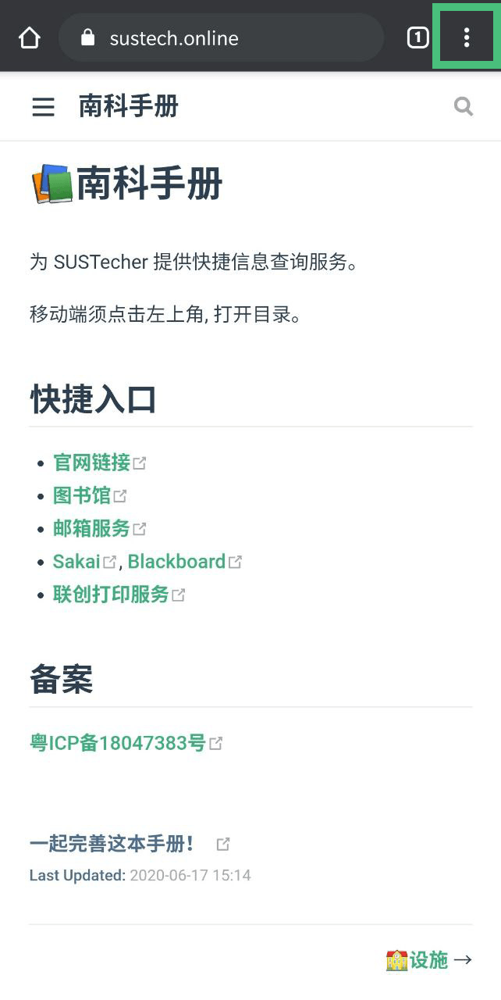
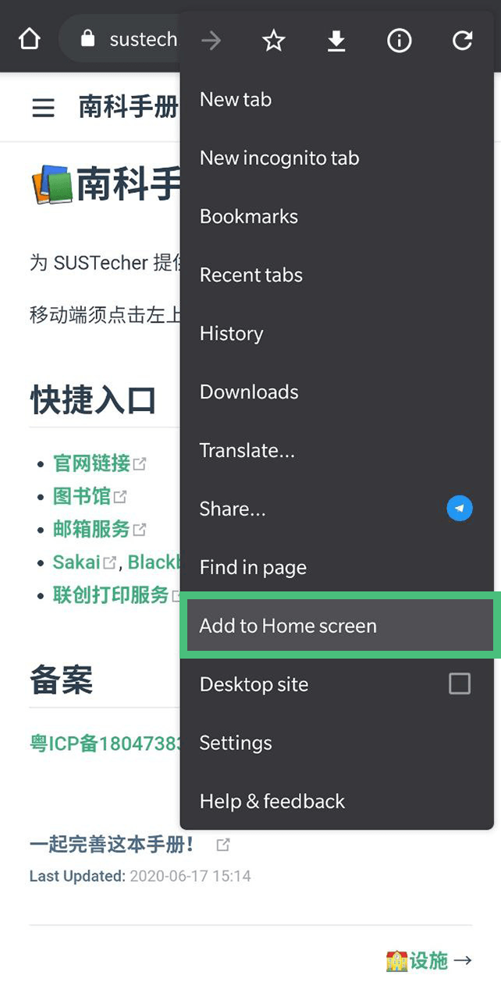
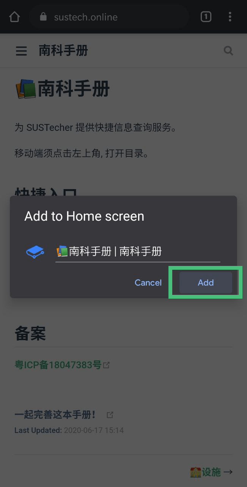
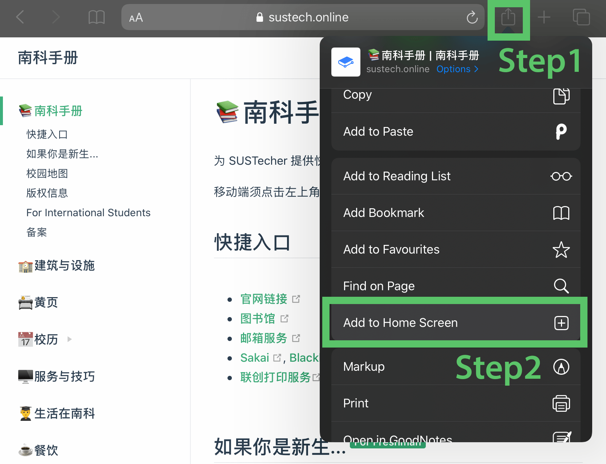
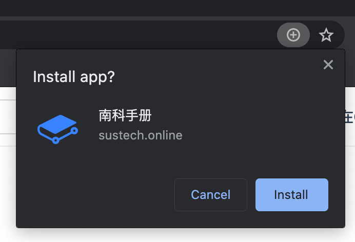

# ❓站点帮助

## 从模板开始贡献

如果栏目首页还是占位页，请先阅读[贡献模板与示例](./contribution-template.md)。里面按校历、服务、设施、交通、应急、组织等场景提供了可复制的条目结构。

## 添加水专手册到桌面

水专手册支持[PWA](https://sspai.com/post/60928)[(Progressive Web App)](https://web.dev/progressive-web-apps/)，这意味着您可以将它添加到桌面，并作为一个本地应用使用。因此，在下载应用后，即使在网络不佳的环境下，您依然可以阅读水专手册上的内容。

### Andoid

以Chrome为例：

1. 点击右上角的三个点

2. 点击“添加到主屏幕”

3. 点击“添加”

### iOS

在Safari中打开水专手册**（只有Safari可以添加）**

按图示操作即可：点击**图标**-**添加到主屏幕**。

### 桌面设备（Windows/Mac OS X）

以Chrome浏览器为例，Edge或是其他国产浏览器流程类似。

点击地址栏右侧的**加号**➕，点击**安装**即可添加到桌面。
